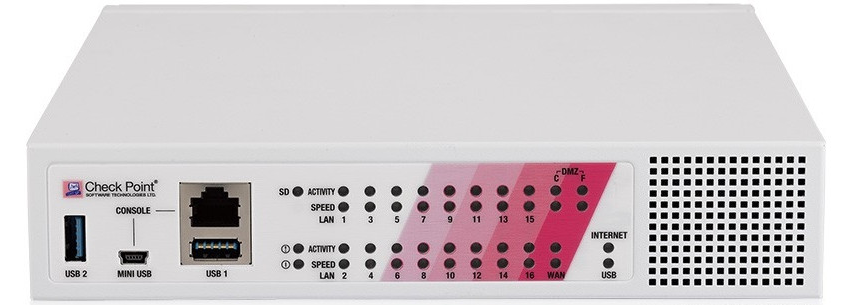
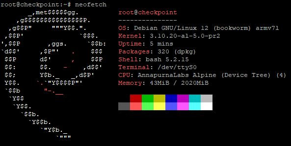

# Debian on CheckPoint L72 (770) Firewall Appliance





## Device specifications
- CPU  : 4 cores ARMv7 @ 1.7Ghz
- RAM  : 2048 MiB
- NAND : 2048 MiB
- ETH  : 4 ports accessible directly (WAN/DMZ), 16 behind PCIe device 
- USB : 2 USB 3.0 ports
- CONSOLE : RJ45 (Cisco) + USB MiniB

# Getting started

## Prerequisite

- USB Mini-B cable to connect console or RJ45 (Cisco) console cable
- USB Drive formated as FAT32 or EXT3 (EXT4 is doable, but the kernel 3.10 doesn't recognise newer EXT4 args)
- Following package on a Linux machine :
    - debootstrap
    - qemu-user-static
    - binfmt-support
    - u-boot-tools
    - tftpd-hpa
    - binwalk
    - cpio

## 1. Boot in maintenance mode

- Connect console cable
- Connect device to power
- Using a terminal emulator (PuTTY, Picocom, ...), connect to the serial console (baudrate: 115200)
- Hit `CTRL+C` when prompted
- Choose `option 3`
- Maintenance mode is ready when you see the following : `[Expert@Gateway-ID-ABCDEFG]#`

If a maintenance password was set and you don't know it, do a factory reset of the device either by holding "FACTORY DEFAULT" for 10sec when pluging in the power or by choosing option 4 in the boot menu.

## 2. Dump NAND

- Copy `nand_to_usb.sh` to the USB drive
- Boot into maintenance mode
- Plug USB drive on device, first partition of the drive is automatically mounted under `/mnt/usb1`
- Execute `cd /mnt/usb1; ./nand_to_usb.sh`, it should take a few minutes.
- Examine result, you should have 10 files.
- Unmount drive `umount /mne/usb1`
- Copy all files from USB drive to `img/` 

To confirmation your dump is working, you can try to boot the kernel image from a TFTP server.

- First, convert the raw dump into a uImage : `dd if=linux_kernel.bin of=uImage bs=4096 skip=1`. 
This is necessary because the first 4096bytes are vendor comments not a uImage header.
- Copy uImage to a TFTP server
- Connect ethernet cable to port `DMZ`
- Reboot device. When prompted hit `CTRL+C`
- Choose hidden `option b`
- Follow the instruction from device

## 3. Create a Debian ARM USB disk
- Change directory to `script/`
- Run `bootstrap_debian_12.sh`
- Run `configure_debian_12.sh`
- Create 2 parition on a USB Disk, first 512M formated ext3 and second remaining space formated ext3
- Open `mount_disk.sh` and edit UUID to match your partitions UUID
- Run `debian_12_to_disk.sh`
- Unplug drive from Linux PC and plug it on device

## 4. Extract and modify initramfs

- From the script directory, run `extract_initramfs.sh`. This will automatically extract the initramfs from `linux_kernel.bin`
- Change directory to `kernel/original/initramfs/`
- Rename vendor init `mv sbin/init sbin/init.vendor`
- Remove old symlink `rm -f init`
- Create a new `init` file in directory `initramfs/` with the following
```sh
#!/bin/sh

mount -t proc     proc     /proc
mount -t sysfs    sysfs    /sys
mount -t devtmpfs devtmpfs /dev

echo "=== Custom init ==="
echo "Waiting for USB initialization..."
sleep 3

mkdir -p /debian
if mount -t ext3 /dev/sda2 /debian 2>/dev/null; then
    echo "=== Debian on /dev/sda2 mounted — switching root ==="
    mount --move /proc /debian/proc
    mount --move /sys  /debian/sys
    mount --move /dev  /debian/dev
    exec /sbin/switch_root /debian /sbin/init
fi
echo "=== USB failed ==="
exec /bin/sh
```
- Make it executable `chmod +x init`

## 5. Repack initramfs

### A. As a standalone file
- Change directory to `scripts/`
- Run `build_initramfs_standalone.sh` to create a standalone file

### B. Inside the kernel uImage
TO DO : WRITE METHOD

## 6. Boot new initramfs

### A. From TFTP with original kernel uImage and `initramfs.uimg`
- Boot into maintenance mode
- Change boot option in device
```sh
fw_setenv bootcmd 'boot_init_before_kernel; tftpboot $loadaddr_payload uImage; tftpboot 0x06000000 initramfs.uimg; setenv bootargs root=/dev/sda2 rw console=ttyS0,115200 pci=pcie_bus_perf mem=2046M; bootm $loadaddr_payload 0x06000000 $fdtaddr'
```

Or with network

```sh
fw_setenv bootcmd 'boot_init_before_kernel; tftpboot $loadaddr_payload uImage; tftpboot 0x06000000 initramfs.uimg; setenv bootargs root=/dev/sda2 rw ip=[DEVICE-IP]::[GATEWAY-IP]:[MASK]:checkpoint:eth1:none console=ttyS0,115200 pci=pcie_bus_perf mem=2046M; bootm $loadaddr_payload 0x06000000 $fdtaddr'
```

- Reboot device